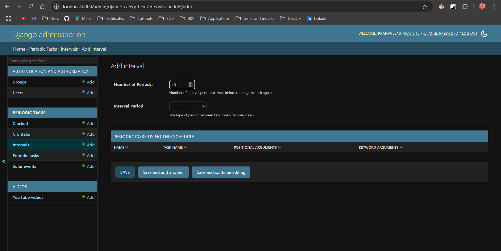
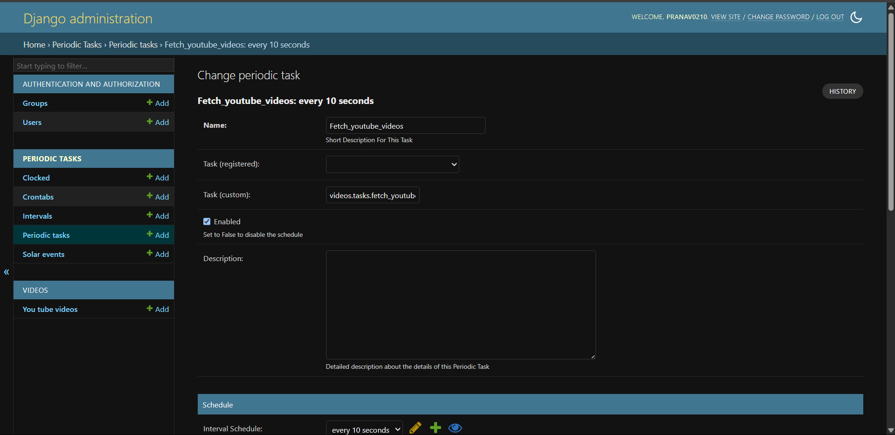

# Youtube API Django DRF Project

This is a Django + Django Rest Framework (DRF) project. API to fetch latest videos sorted in reverse chronological order of their publishing date-time from YouTube for a given tag/search query in a paginated response.

# Table of Contents
1. [Requirements](#requirements)
2. [Environment Variables](#environment-variables)
3. [Setup PipENV](#setup-pipenv)
4. [The Process](#how-i-worked-this-assignment-out)

## Requirements

- Python 3.9+
- pipenv

## Environment Variables
   - Create a `.env` file in the project root
   - Copy the keys from the `example.env` file into the created `.env` file

## Setup PipENV

#### 1. Install dependencies and create a virtual environment:

   ```bash
   pipenv install
   pipenv install
   ```

#### 2. Activate pipenv virtual environment:

   ```bash
   pipenv shell
   pipenv shell
   ```

#### 3. Run the migrations to set up the database:

   ```bash
   celery -A fam_youtube_api beat --loglevel=info
   ```

#### 4. Start celery worker
   ```bash
   celery -A fam_youtube_api worker --loglevel=info
   ```

#### 5. Start celery beat
   ```bash
   celery -A fam_youtube_api beat --loglevel=info
   ```

#### 6. Start the development server:

   ```bash
   python3 manage.py runserver
   ```

#### 7. Setup the user password:
   ```bash
   python manage.py createsuperuser
   ```

#### 8. Setup Celery beat and enable it:

   Step 1: Go to add Intervals (http://localhost:8000/admin/django_celery_beat/intervalschedule/add/) -> 
      select the interval at which you want to fetch the YouTube API and click save. 

   

   Step 2: Go to add Periodic tasks (http://localhost:8000/admin/django_celery_beat/periodictask/add/) -> 
      select the interval that you just created and save
      
   

#### 8. Access the API:

      Open your browser and go to `http://localhost:8000/admin/videos/youtubevideo/` to see the list of YouTube videos.

#### 9. API Endpoints:

   GET /api/videos/

      GET http://localhost:8000/api/videos?page=&page_size=

   GET /api/search/

      GET http://localhost:8000/api/search/?query=&page=&page_size=


## How I worked this assignment out:

### The choice of framework -
   I went through the guide "The Story Behind Fampay's Tech Stack" created by Pratik Gajjar and found out that at Fam we use Django + DRF for all backend parts. The choice seemed like natural to me. Django's power is unparalleled in addition it provides the admin page that would be great to create an interface to view all the videos fetched in our project.
   So, Django + DRF for the win Fam! 

### The folder structure -
   I usually follow the folder structure divided into the data/domain/interface structure to separate out the responsibilities in a clean and modular way. However, for this particular project it seemed like an overkill with almost more empty __init__.py files that there were for the working code!
   So, I settled with the common apps separation structure. To give a gist of the structure that I usually follow it is as below:

  ```md
   src/
    fam_youtube_api/
        data/
            migrations/
            models/
        domain/
            baskets/
            orders/
            products/
            users/
        interfaces/
            actions/
                management/
                    commands/
            dashboard/
                orders/
                products/
                users/
            store/
                account/
                basket/
                checkout/
                products/
    tests/
        functional/
        unit/
   ```


### The Problem Statement break down -
   There are two major sub-problems to the problem statement put forward.

      1. The scheduled task of fetching the videos in the background.
      2. Searching through the db for videos in an efficient way.

<details>
   <summary>[A] Scheduling the fetch tasks in background</summary>

   ---
      We need to periodically fetch thousands of YouTube videos using the YouTube Data API. This involves:
     
      a. Making network requests (slow I/O)
      b. Handling pagination across many pages
      c. Parsing and saving data into the database
      d. Managing API rate limits and retries
      
      All of this would block our main Django application if done synchronously or in the request/response cycle.

   Celery handles the heavy lifting of periodic, paginated, rate-limited API ingestion so our Django app can stay responsive, accurate, and up to date — without running into timeouts or blocking issues.

   We defined a task fetch_youtube_videos in videos/tasks.py and scheduled it to run every 10 seconds using Celery Beat.

   **Fetching Logic** - The Celery task:

      - Uses a publishedAfter timestamp to avoid duplicate videos
      - Iterates through multiple API keys (if one is exhausted)
      - Follows pagination to collect all results from the YouTube API
      - Stores each new video in the DB

   **Snapshot Consistency**
   
      - Because YouTube returns a consistent snapshot per publishedAfter, we make sure the timestamp is updated only after the first successful API call, so pagination continues to work correctly.
</details>

<details>
   <summary>[B] Searching through the videos</summary>

   ---
      We want to implement a search API to allow users to find YouTube videos by matching their title or description. We expect:

      a. A growing number of stored videos
      b. The need for relevant, ranked results
      c. A lightweight, fast, and scalable alternative to something heavy like Elasticsearch

   Currently I have a basic search that suffices for the need and matches for words appearing in the title and description. I personally want it supercharged that can capture the essense of our search and yet not be very heavy to manage/maintain and handle as an overhead like Elasticsearch!

   So, I'm setting up PostgreSQL in my project because SQLite is anyway not meant for production use & the sole reason above. Exiting what Postgres can do out of the box!

   PostgreSQL provides powerful full-text search capabilities built into the database engine:
      
      - Supports stemming, tokenization, ranking, phrase matching
      - Efficient with GIN indexes
      - Integrates directly with Django via SearchVector, SearchQuery, and SearchRank
   
   PostgreSQL Full-Text Search gives this project the ability to search across YouTube videos in a fast, relevant, and scalable way — all without needing to manage a separate search system.

</details>

## ✨ I Really Had Fun! (Still having as I work over the Postgres full text search) 😄🚀 -
   Honestly, working on this project has been such a fun ride! I started with just a basic idea, and then things kept growing — from calling the YouTube API to saving videos in the database, setting up Celery (which felt super cool once it worked 😄), and even switching to PostgreSQL for full-text search. Every bug, every "aha!" moment — it’s been super exciting. I’m still learning a lot as I go, and I can’t wait to keep making it better!

   Hope you like the Ideas I have put forth. Excited to discuss these with you soon!


## How I worked this assignment out:

### The choice of framework -
### The folder structure -
### The Problem Statement break down -
### I had fun! -